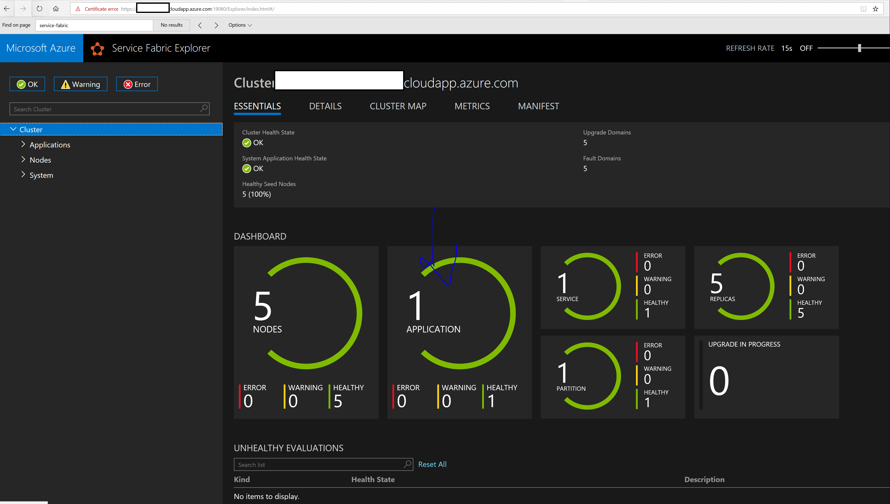
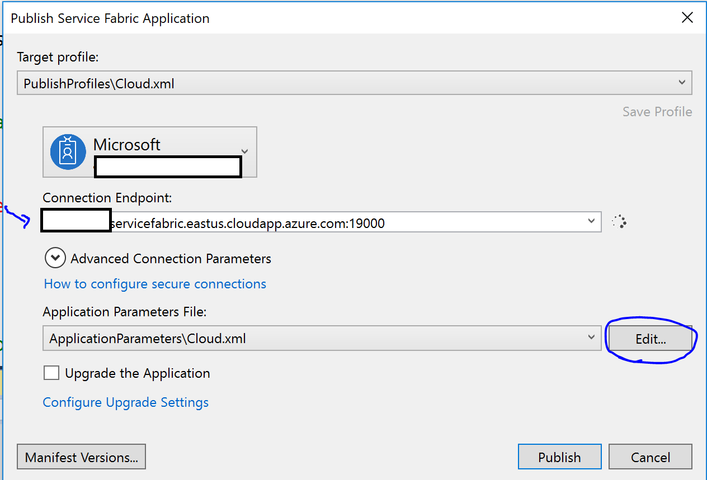
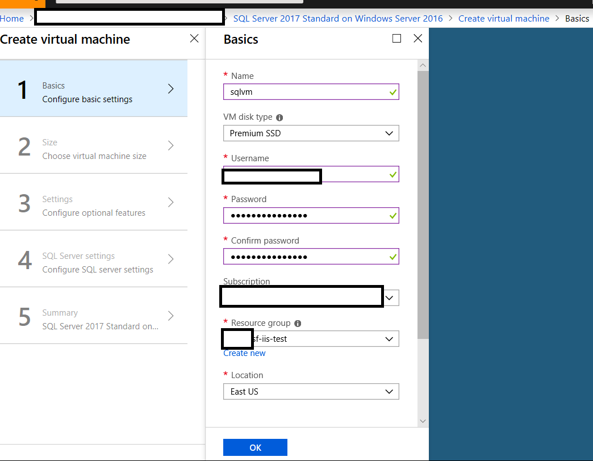

# IIS Lift and Shift - Service Fabric Cluster

This will be an expansion on the concepts from the [IIS Lift and Shift Scenario](./README-IIS.md).

To support better orchestartion of the containers, we'll host the applications inside of an Azure Service Fabric cluster.  At a glance, we can think of it as sticking the frontend and backend containers in a cluster, and using appropriate service discovery (SF Cluster includes its own DNS to resolve service to service) and making sure that components which are external to the cluster resolve to the appropriate container.  We'll use the external load balancer for the frontend containers in the Azure Service Fabric Cluster, and the Internal Load Balancer for backend container resolution.


In order to complete this scenario, you will need to have a DC and SQL Server available on the network that the Service Fabric Cluster will be deployed on.  You can find additional notes about setting up SQL Server at the bottom of this README.

You will also need to have GMSAs set up in a siml

## GMSA Set up
For convenience, this is rolled up in this [script](../AD/sf-cluster/gmsa-creation.ps1)

We'll want to adapt frontend and backend from the [gmsa creation script](../AD/create-gmsa/gmsacreation.ps1) , and run it on the AD VM (DC).


```powershell
# FOR IIS Scenarios ONLY #	
#frontend GMSA
New-ADServiceAccount -Name FRONTEND -DNSHostName frontend.win.local -ServicePrincipalNames http/frontend -PrincipalsAllowedToRetrieveManagedPassword "Domain Controllers", "domain admins", "containerhosts" -KerberosEncryptionType RC4, AES128, AES256
Set-ADServiceAccount -Identity frontend -PrincipalsAllowedToRetrieveManagedPassword 'domain admins','domain controllers','containerhosts'
Set-ADServiceAccount -identity frontend -replace @{'msDS-AllowedToDelegateTo'='LDAP/adVM.win.local','HTTP/backend.win.local','HTTP/conhost000000.win.local','HTTP/conhost000001.win.local','HTTP/conhost000002.win.local','HTTP/conhost000003.win.local','HTTP/conhost000004.win.local'}
Set-ADServiceAccount -identity frontend -replace @{userAccountControl=16781312}
#confirm SPN
SetSPN -l win\frontend$
#backend GMSA
New-ADServiceAccount -Name BACKEND -DNSHostName backend.win.local -ServicePrincipalNames http/backend -PrincipalsAllowedToRetrieveManagedPassword "Domain Controllers", "domain admins", "containerhosts" -KerberosEncryptionType RC4, AES128, AES256
$impersonation = Get-ADServiceAccount -Identity frontend
Set-ADServiceAccount -Identity backend -PrincipalsAllowedToDelegateToAccount $impersonation
Set-ADServiceAccount -identity backend -replace @{'msDS-AllowedToDelegateTo'='LDAP/adVM.win.local','HTTP/conhost000000.win.local','HTTP/conhost000001.win.local','HTTP/conhost000002.win.local','HTTP/conhost000003.win.local','HTTP/conhost000004.win.local'}
Set-ADServiceAccount -identity backend -replace @{userAccountControl=16781312}
#confirm SPN
SetSPN -l win\backend$

```
We can confirm the frontend settings.

```powershell
get-adserviceaccount -identity frontend -properties 'PrincipalsAllowedToDelegateToAccount','PrincipalsAllowedToRetrieveManagedPassword','kerberosEncryptionType','ServicePrincipalName','msDS-AllowedToDelegateTo','userAccountControl','PrincipalsAllowedToDelegateToAccount'
```

We can confirm the backend settings.

```powershell
get-adserviceaccount -identity backend -properties 'PrincipalsAllowedToDelegateToAccount','PrincipalsAllowedToRetrieveManagedPassword','kerberosEncryptionType','ServicePrincipalName','msDS-AllowedToDelegateTo','userAccountControl','PrincipalsAllowedToDelegateToAccount'
```


### A Note on Scaling in 1803 with GMSA
Of course, this becomes interesting with how to scale it.  In the 1803 configuration, GMSA set up requires that each of the frontend containers is uniquely named and matched with its own GMSA.  So five instances of frontend, five different frontend GMSAs.  Same with the backend containers and corresponding GMSAs - five backend containers and 5 GMSAs.  This also means that the SF Cluster DNS (and naming for the services) as well as the usage of the Load balancers will need to be configured appropriately to handle it.  *We are not addressing these challenges in this setup.*

### To keep things simple...
We'll use an example that has one GMSA for the frontend, and one GMSA for the backend, which will be shared by the replicas.  While this isn't **ideal** for 1803 windows containers deployments, it should, in theory, more closely reflect what should be a set up for 1809 deployments. It is expected that we will see AD Trust related errors when we scale the containers above a single replica. 


## Additional Information about Service Fabric

These will describe some of the concepts that we're using in this scenario.

1. [Example Service Fabric Cluster Deployment](https://github.com/Azure/azure-quickstart-templates/tree/master/service-fabric-secure-cluster-5-node-1-nodetype)
1. [Managing Secrets in Service Fabric Applications](https://docs.microsoft.com/en-us/azure/service-fabric/service-fabric-application-secret-management)
1. [Service Fabric Apps with Containers](https://docs.microsoft.com/en-us/azure/service-fabric/service-fabric-host-app-in-a-container)
1. [Service Fabric Apps with CI/CD](https://docs.microsoft.com/en-us/azure/service-fabric/service-fabric-tutorial-deploy-app-with-cicd-vsts)
1. [Service Fabric Development Environment](https://docs.microsoft.com/en-us/azure/service-fabric/service-fabric-get-started)
1. [Service Fabric Cluster Creation through the Portal](https://docs.microsoft.com/en-us/azure/service-fabric/service-fabric-cluster-creation-via-portal)
1. [Connecting to a Service Fabric Cluster](https://docs.microsoft.com/en-us/azure/service-fabric/service-fabric-connect-to-secure-cluster)
1. [Service Fabric Deploy and Remove Apps](https://docs.microsoft.com/en-us/azure/service-fabric/service-fabric-deploy-remove-applications)
1. [Change SQL Server Authentication Mode](https://docs.microsoft.com/en-us/sql/database-engine/configure-windows/change-server-authentication-mode?view=sql-server-2017)

# Service Fabric Setup

We'll want to set up the nodes using a Azure Virtual Machine Scale Set in a Service Fabric Cluster. This means we'll want to make sure we have a management certificate, and which we'll stick in Azure KeyVault.  *The default Azure portal setup of Service Fabric will step you through the certificate and KeyVault setup*

## ARM Template Deployment of Service Fabric (Optional)

The portal deployment for Azure Service Fabric using 1803 VMs should be sufficent for this scenario, however if you'd like to use a templated deployment to customize things further, that is also supported. 

We'll want to update the vmImageSku to point to the 1803 image, which is in the [service fabric deployment parameters json file](../AD/sf-cluster/sfparameters.json).

```json
"vmImageSku": {
	"type":"string",
	"defaultValue":"2016-Datacenter",
	"metadata": {
	"description":"VM image SKU"
	}
```

The deployment parameter should use the 1803 image.  We can also pass through at run time from the azure cli.
```json
 "vmImageSku": {
            "value": "Datacenter-Core-1803-with-Containers-smalldisk"
        },
```

### Set up Key Vault and Management Certificate 

We'll want to provide a resource group to hold our sample cluster, and also an Azure Key Vault.  We'll start with the Azure Key Vault.

```Powershell
$kvName = 'my-kv-sf'
$kvRG = 'my-sf-iis-test'
$location = 'EastUS'

New-AzureRmResourceGroup -Name $kvRG -Location $location 
New-AzureRmKeyVault -VaultName $kvName -ResourceGroupName $kvRG -Location $location -EnabledForDeployment
```


We'll want to run this [Service Fabric Certificate Powershell Script](https://github.com/Azure/azure-quickstart-templates/blob/master/service-fabric-secure-cluster-5-node-1-nodetype/New-ServiceFabricClusterCertificate.ps1) and supply a password, certificate DNS name, key vault, and name of the key vault secret.

We have a [local copy](../AD/sf-cluster/New-ServiceFabricClusterCertificate.ps1) of the script, but the updated one should be grabbed from the [Example Service Fabric Deployment sample](https://github.com/Azure/azure-quickstart-templates/tree/master/service-fabric-secure-cluster-5-node-1-nodetype).

```powershell
$pw = 'mypw'
$certDNSName = 'my-sf-1'
$kvName = 'my-kv-sf'
$kvSecretName = 'my-kv-secret'
.\New-ServiceFabricClusterCertificate.ps1 -Password $pw -CertDNSName $certDNSName -KeyVaultName $kvName -KeyVaultSecretName $kvSecretName
```


Add Certificate to Key Vault.  Be sure to include a name and the password used in the script.  This is the password associated with the certificate.


Confirm that the secret exists.  Also, this will be a management certificate that will allow us to use the Service Fabric Explorer.


### Deploy Service Fabric Cluster

We'll also want to make sure that we use the output of the script to get the appropriate values for the certificateThumbprint, sourceVaultResourceId, and certificateUrlValue.  We can fill in the rest of the details in the [deployment parameters json file](../AD/sf-cluster/sfparameters.json).

```az cli
az group deployment create --name ServiceFabricDeployment --resource-group my-sf-
iis-test --template-file .\sftemplate.json --parameters .\sfparameters.json
```

# Using the Service Fabric Explorer

We can navigate to the [Azure Portal](https://portal.azure.com) and check on the deployment for Service Fabric.  We should be able to see a test endpoint and a management endpoint.  


The test endpoint will let us test the web applications that we'll deploy to the Service Fabric cluster.

The management endpoint will let us use the service fabric explorer to manage the cluster.  Note that we'll want to make sure we can select the certificate that we uploaded to Azure KeyVault to actually view the contents of the explorer.


# Domain Join Service Fabric Cluster VMs

If your Domain Controller was already in place, your cluster VMs should be able to reach it to join the domain.  If not, you may need to restart the computers.  We can restart the VMSS in the portal.

You may also want to double check your VNET DNS settings. If you change your DNS server for your VNET, you must restart all the VMs in the VNET.  We can restart the boxes from the [Portal](https://portal.azure.com) or else from RDP.


We can confirm the nodes in the VNET.


In case we're using RDP, we can shutdown the VM

```powershell
shutdown /r /f
```
To join each VM in the cluster to the domain, remotely log into each one and run the following Powershell, using the credentials for an account that had domain admin rights.

```powershell
$domain = "win.local"
$password = "P@ssw0rd123!" | ConvertTo-SecureString -asPlainText -Force 
$username = "$domain\Andy"
$credential = New-Object System.Management.Automation.PSCredential($username,$password)
Add-Computer -DomainName $domain -Credential $credential -restart
```
Each VM in the cluster will use a different port for RDP, based on what's in the LB NAT rules.


If you have issues remotely logging in, the user may need to be added for remote login.

```powershell
net localgroup "Remote Desktop Users" "win.local\Domain Admins" /add
```

Once the node is back up, we can confirm that we've joined the domain

```powershell
nltest /parentdomain
```


Once the VMs are joined to the domain, the all need to be added to the Container Hosts security group in order to use the GMSA accounts with the containers. 

```powershell
$group = New-ADGroup -GroupCategory Security -DisplayName "Container Hosts" -Name containerhosts -GroupScope Universal 
$group | Add-ADGroupMember -Members (Get-ADComputer -Identity host)

$group | Add-ADGroupMember -Members (Get-ADComputer -Identity conhost000000)
$group | Add-ADGroupMember -Members (Get-ADComputer -Identity conhost000001)
$group | Add-ADGroupMember -Members (Get-ADComputer -Identity conhost000002)
$group | Add-ADGroupMember -Members (Get-ADComputer -Identity conhost000003)
$group | Add-ADGroupMember -Members (Get-ADComputer -Identity conhost000004)
```


# Install the CredSpec Files on Each Cluster VM.

We'll want to remote into each of the nodes. We can use the IP:port mapping from the Azure Load Balancer NAT rules, just like we did to domain join them.

```powershell
Add-WindowsFeature RSAT-AD-PowerShell 
Install-WindowsFeature ADLDS 
Import-Module ActiveDirectory 
Install-ADServiceAccount frontend
Install-ADServiceAccount backend
Shutdown /r /f
```

Login to the node from the Virtual Machine Scale Set.  We'll create a credential spec, but we could also copy over the credential spec as well.

```powershell
Test-ADServiceAccount frontend 
Test-ADServiceAccount backend

Start-BitsTransfer https://raw.githubusercontent.com/Microsoft/Virtualization-Documentation/live/windows-server-container-tools/ServiceAccounts/CredentialSpec.psm1 
Import-Module .\CredentialSpec.psm1 
New-CredentialSpec -Name frontend -AccountName frontend 
New-CredentialSpec -Name backend -AccountName backend # should output location of the files Get-CredentialSpec
```

# Host Setup and Load Balancers

Finally, we'll also want to open some ports on the container host for testing (this is if we'd like to test from an off network browser.)  We'll use **port 80** for testing purposes.

```
netsh advfirewall firewall add rule name="Open Port 80" dir=in action=allow protocol=TCP localport=80
netsh advfirewall firewall add rule name="Open Port 80 out" dir=out action=allow protocol=TCP localport=80
```

Since we're going to use a Load Balancer and the Virtual Machine Scale Set, we'll want to make sure the frontend IP configuration, backend pools, health probes, inbound nat rules, and load balancing rules are set up correctly.


Inbound NAT rules will map to the LB and the appropriate port for each VMSS node.


For the ILB, we'll want to be sure we can map the nodes and use the SQL port 1433.


# Deploying an Application

We'll use Visual Studio to set up the Service Fabric Templates.  We'll want to make sure we have our [Service Fabric Development Environment](https://docs.microsoft.com/en-us/azure/service-fabric/service-fabric-get-started) set up so we can use Visual Studio to create and manage Service Fabric services.


We'll want to comment out repository information since this is a public image.


We can also try to publish an app to the cluster.


Upon success, we can check the service fabric explorer and see that an application is now in the cluster.


We can also test the frontend, by going to the test endpoint.  If we're getting prompted from the browser, then we've been able to deploy the frontend container.


## Run the 1803 Containers with Service Fabric Cluster

We'll want to make sure we open up the [Solution](../auth-examples/service-fabric-cluster/WindowContainer.sln) in Visual Studio.


We'll want to make sure to update the cloud.xml publish profile in each project; this will let us specify the management endpoint and certificate we'd like to use in order to publish to Service Fabric Cluster.

```xml
<ClusterConnectionParameters       ConnectionEndpoint="mycluster.westus.cloudapp.azure.com:19000"
    X509Credential="true"
    ServerCertThumbprint="0123456789012345678901234567890123456789"
    FindType="FindByThumbprint"
    FindValue="9876543210987654321098765432109876543210"
    StoreLocation="CurrentUser"
    StoreName="My" />
```

We'll use the right-click deploy on each of the projects.  Note that the settings in the Application Manifest and the Service Manifest will reflect the settings that we would've used otherwise in the docker run command.

We'll update the frontend app manifest to use the GMSA, port, and DNS settings.


We'll update the frontend service manifest to use the image name, environment variable for the endpoint, and the port mapping. 


We can right-click publish on the project to deploy the frontend using Visual Studio.  If we'd like to edit the publish settings, we can also update the app parameters file (with manual editing in XML or in the UI).



We'll update the backend app manifest to use the gMSA, port, and DNS settings.


We'll update the backend service manifest to use the image name, environment variable for the connection string, and the port mappings. 


We can right-click publish on the project to deploy the backend using Visual Studio.  If we'd like to edit the publish settings, we can also update the app parameters file (with manual editing in XML or in the UI).


Assuming that we're logged into one of the cluster nodes, we should be able to verify the running containers.

```powershell
docker ps
```


We should use the test endpoint for the Service Fabric Cluster.  If we click on the 'about' tab, we'll ping the backend and SQL.


Also, if we log out and login with a different user (user2 for example), we'll see that the UPN is picked up and a different set of data returns for that user.


### Environment variables

* USER - This will search for a UPN to try to impersonate.
* CONNECTION - This is a connection string used by the **backend** container in order to reach out to a SQL Server.  Note that the container must have network connectivity and the identity (**gMSA account**) used by the container must have rights to the SQL Server. 'Server=sqlserver.win.local;Database=
testdb;Integrated Security=SSPI' would be a good example.
* API_URL - This is used by the **frontend** container in order to send requests to a **backend** API.  Note that the port number may change if these contaienrs are hosted in the same box (e.g. backend.win.local:81) 

***

# Setup for the SQL VM.
If you've tried the non-Service Fabric example for IIS, you should already have a SQL server in your domain. However, if you don't, you can use the Portal to deploy a SQL VM.



Make sure we choose settings for size and network.


Make sure we choose settings for network.


Make sure we choose settings for SQL Server.


Upon reviewing, we should be able to deploy SQL.


## SQL Server SQL Authentication

If we want to enable a System Administrator account in SQL, we could use T-SQL to accomplish it.

[Change SQL Server Authentication Mode](https://docs.microsoft.com/en-us/sql/database-engine/configure-windows/change-server-authentication-mode?view=sql-server-2017)

```SQL
ALTER LOGIN sa ENABLE ;  
GO  
ALTER LOGIN sa WITH PASSWORD = '<enterStrongPasswordHere>' ;  
GO 
```
## Testing with SQL

We can hop onto one of the nodes in the cluster, and then see if we can get any SQL visibility.

We can fill in the details to test SQL connectivity with this [Test Script](../AD/sf-cluster/testsql.ps1)

## Sample Data

At this time, we have not provided a template to add and configure an SQL server on the domain. You can add in the SQL server however you choose, however it must be domain joined.  If you use the SQL Server image that's available in Azure, you may have issue accessing the default instance after you join the server to the domain.  There's a workaround for SQL Server acceess here: [SQL Server Setup Notes](https://docs.microsoft.com/en-us/sql/database-engine/configure-windows/connect-to-sql-server-when-system-administrators-are-locked-out?view=sql-server-2017).

We're going to use the sample data that's included in the [script](../AD/data/testdata.sql).  Please populate SQL with the sample data, schema, and logins.

We'll also want to include the backend gMSA account as part of the SQL logins and have datareader / datawriter rights to the testdb.

If we've populated it correctly, we should see our table with some data in it.


```SQL
SELECT *
  FROM [testdb].[dbo].[testdata]
```

## Test Users (Optional)

We can add test users to the DC. 

```powershell
New-ADUser -Name User1 -PasswordNeverExpires $true -AccountPassword ("Password123!" | ConvertTo-SecureString -AsPlainText -Force) -Enabled $true -UserPrincipalName User1@win.local	
	$user1 = Get-ADUser User1
	New-ADUser -Name User2 -PasswordNeverExpires $true -AccountPassword ("Password123!" | ConvertTo-SecureString -AsPlainText -Force) -Enabled $true -UserPrincipalName User2@win.local
	$user2 = Get-ADUser User2
	New-ADUser -Name User3 -PasswordNeverExpires $true -AccountPassword ("Password123!" | ConvertTo-SecureString -AsPlainText -Force) -Enabled $true -UserPrincipalName User3@win.local
	$user3 = Get-ADUser User3
```

This is also in the [domain basics script](../AD/ad-new-forest-domain/domainbasics.ps1)


# Troubleshooting

###Container Running Notes

Set host name to the same as the name of the gmsa.  See other [debugging tips](https://github.com/MicrosoftDocs/Virtualization-Documentation/blob/a887583835a91a27b7b1289ec6059808bd912ab1/virtualization/windowscontainers/manage-containers/walkthrough-iis-serviceaccount.md#test-a-container-using-the-service-account).

```powershell
docker run -h app1 -it --security-opt "credentialspec=file://app1.json" microsoft/windowsservercore:1709 cmd
```

### Test gMSA in Container

Refer to the [gMSA creation script](../AD/create-gmsa/gmsacreation.ps1) and [gMSA notes](../AD/create-gmsa/README.md).

We'll also want to verify the properties are set correctly.

```
get-adserviceaccount -identity MSMQSend -properties 'PrincipalsAllowedToDelegateToAccount','PrincipalsAllowedToRetrieveManagedPassword','kerberosEncryptionType','ServicePrincipalName','msDS-AllowedToDelegateTo','userAccountControl','PrincipalsAllowedToDelegateToAccount'
```


### Advanced Debugging

Kerberos debugging - kerberos ticket check. From inside the container, run:

```powershell
klist
```

### Remote Debugging
Remote debug by installing VS debugger in the container. [Remote Debugging Notes](README-Remote-Debugging.md).

-----
## Run the 1803 Build with Docker on Cluster Node

This test will mimic what we'll run with Service Fabric.

We'll want a **frontend** container, assuming that we've set up our **frontend** gMSA.

```powershell
docker run -h frontend -d -p 80:80 -p 4022:4022 -p 4023:4023 --security-opt "credentialspec=file://frontend.json" -e API_URL=http://backend.win.local:81 <myrepo>/windows-ad:impersonate-explicit-frontend-1803
```

We'll want a **backend** container, assuming that we've set up our **backend** gMSA.

```powershell
docker run -h backend -d -p 81:80 -p 1433:1433 -p 4020:4020 -p 4021:4021 --security-opt "credentialspec=file://backend.json" -e TEST_GROUP=WebUsers -e CONNECTION='Server=sqlvm.win.local;Database=
testdb;Integrated Security=SSPI' <myrepo>/windows-ad:impersonate-backend-1803
```

If we click on the 'about' tab, we'll ping the backend and SQL.


Also, if we log out and login with a different user (user2 for example), we'll see that the UPN is picked up and a different set of data returns for that user.


Use docker commands to remove running containers

```powershell
docker stop $(docker ps -a -q)
docker rm $(docker ps -a -q)
```
-----
