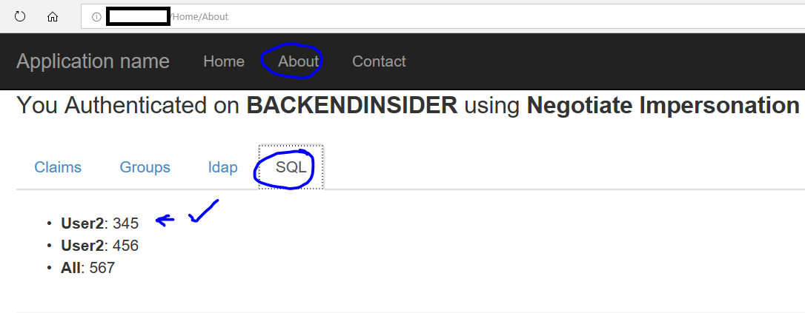
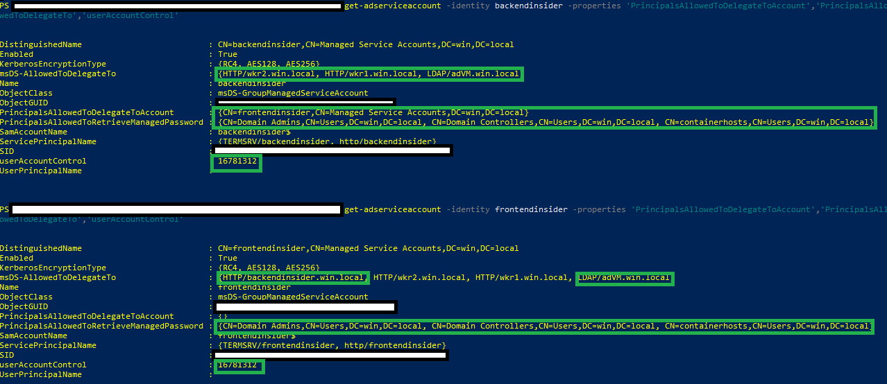

# IIS Lift and Shift
In this scenario we are putting together an IIS web site and hosting it in a Windows Container.

The following criteria will be met for the application:
* The frontend will send a request to the backend API.  
* The Backend API will then query SQL using the credentials passed to it from the frontend + UPN from the user in the request from the browser.  (Containers are able to use ONLY their GMSA credential, so for this step, application code needs to be added to explicitly pass the credentials of the logged in user.)
* The frontend and backend will use separate GMSA accounts.  
* The frontend GMSA account will be allowed to delegate to the backend GMSA account.


## Host Setup

Make sure you are using a container host VM that matches the [version](https://docs.microsoft.com/en-us/virtualization/windowscontainers/deploy-containers/version-compatibility) of the container you are running.  

We'll also want to open some ports on the container host for testing (this is if we'd like to test from an off network browser.)  We'll use **port 80** for testing purposes, since this scenario is IIS-based.

```
netsh advfirewall firewall add rule name="Open Port 80" dir=in action=allow protocol=TCP localport=80
netsh advfirewall firewall add rule name="Open Port 80 out" dir=out action=allow protocol=TCP localport=80
```

If this container host is a VM hosted in Azure, open the same ports in the [NSG](https://docs.microsoft.com/en-us/azure/virtual-machines/windows/nsg-quickstart-portal), as well.

## GMSA Setup

This scenario requires the GMSAs for the "frontend" and "backend" accounts.  We'll also want to verify the properties are set correctly.

Refer to the [gMSA creation script](../AD/create-gmsa/gmsacreation.ps1) and [gMSA notes](../AD/create-gmsa/README.md).

You also need to created Credspec.json files for both GMSAs and ensure they are available on the container host VM.

## Sample Data

At this time, we have not provided a template to add and configure an SQL server on the domain. You can add in the SQL server however you choose, however it must be domain joined.  If you use the SQL Server image that's available in Azure, you may have issue accessing the default instance after you join the server to the domain.  There's a workaround for SQL Server acceess here: [SQL Server Setup Notes](https://docs.microsoft.com/en-us/sql/database-engine/configure-windows/connect-to-sql-server-when-system-administrators-are-locked-out?view=sql-server-2017).

We're going to use the sample data that's included in the [script](../../AD/data/testdata.sql).  Please populate SQL with the sample data, schema, and logins.

We'll also want to include the backend gMSA account as part of the SQL logins and have datareader / datawriter rights to the testdb.

If we've populated it correctly, we should see our table with some data in it.


## Running the Containers for IIS Frontend and Backend

Remember to set host name of the containers to the same as the name of the GMSAs  See other [debugging tips](https://github.com/MicrosoftDocs/Virtualization-Documentation/blob/a887583835a91a27b7b1289ec6059808bd912ab1/virtualization/windowscontainers/manage-containers/walkthrough-iis-serviceaccount.md#test-a-container-using-the-service-account).

We'll want a **frontend** container, assuming that we've set up our **frontend** GMSA.

```powershell
docker run -h frontend -d -p 80:80 -p 4022:4022 -p 4023:4023 --security-opt "credentialspec=file://frontend.json" -e API_URL=http://backend.win.local:81 <myrepo>/windows-ad:impersonate-explicit-frontend-windowsservercore:1803
```

We'll want a **backend** container, assuming that we've set up our **backend** gMSA.

```powershell
docker run -h backend -d -p 81:80 -p 1433:1433 -p 4020:4020 -p 4021:4021 --security-opt "credentialspec=file://backend.json" -e TEST_GROUP=WebUsers -e CONNECTION='Server=sqlserver.win.local;Database=
testdb;Integrated Security=SSPI' <myrepo>/windows-ad:impersonate-backend-windowsservercore:1803
```

Once both containers are running, you should be able to access the frontend webserver using the public IP of the container host VM at port 80. 

If we click on the 'about' tab, we'll ping the backend and SQL.


Also, if we log out and login with a different user (user2 for example), we'll see that the UPN is picked up and a different set of data returns for that user.




### Environment variables

* USER - This will search for a UPN to try to impersonate.
* CONNECTION - This is a connection string used by the **backend** container in order to reach out to a SQL Server.  Note that the container must have network connectivity and the identity (**gMSA account**) used by the container must have rights to the SQL Server. 'Server=sqlserver.win.local;Database=
testdb;Integrated Security=SSPI' would be a good example.
* API_URL - This is used by the **frontend** container in order to send requests to a **backend** API.  Note that the port number may change if these contaienrs are hosted in the same box (e.g. backend.win.local:81) 

-----
## Troubleshooting

### Test gMSA in Container

```
get-adserviceaccount -identity frontend -properties 'PrincipalsAllowedToDelegateToAccount','PrincipalsAllowedToRetrieveManagedPassword','kerberosEncryptionType','ServicePrincipalName','msDS-AllowedToDelegateTo','userAccountControl','PrincipalsAllowedToDelegateToAccount'
```



### Advanced and Remote Debugging

Kerberos debugging - kerberos ticket check. From inside the container, run:

```powershell
klist
```

Remote debug by installing VS debugger in the container. [Remote Debugging Notes](README-Remote-Debugging.md).


## Server 2019

This scenario has also been tested using an "insider build" of Server 2019. As expected, we must be using the matching host for the build environment (e.g. Windows Server 2019) and we must also have an ability to use msbuild.  This can be achieved through a container image (pending) or for now, through an insider image to copy the contents of an already built application.  For now, we can use Visual Studio 2017 https://visualstudio.microsoft.com/vs/community/ to complete the build of the assets, and then run the build / copy script.

```powershell
./auth-examples/build.10.0.17666.1000-copy.ps1 <your-docker-repo>
```

To publish to a docker repository:

```powershell
docker login
./auth-examples/push.10.0.17666.1000-copy.ps1 <your-docker-repo>
```


