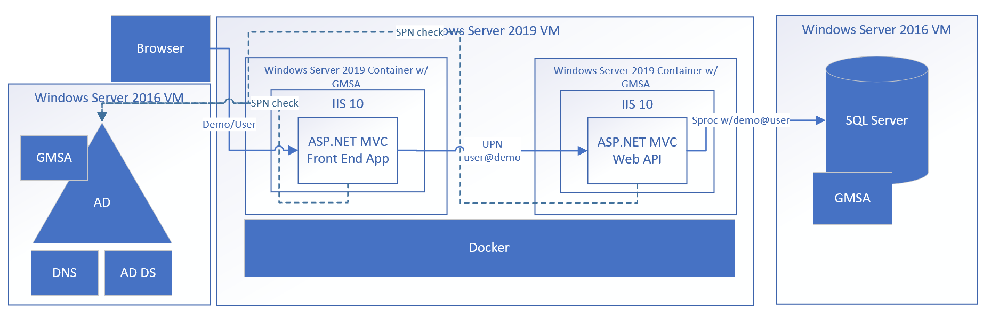
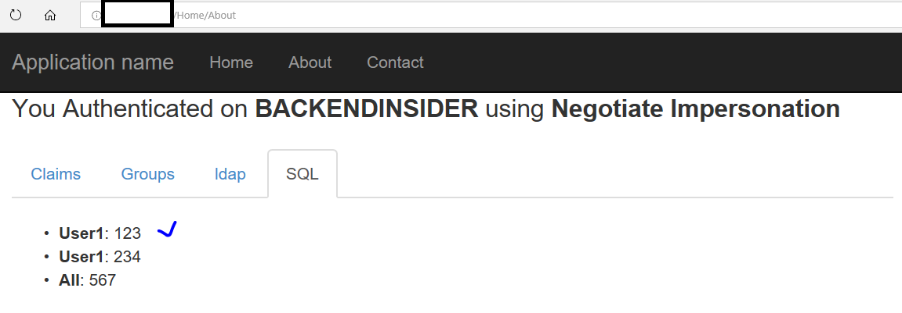

## IIS Lift and Shift
We'd like to put together an IIS web site and host it in a Windows Container.

The frontend will send a request to the backend API.  The Backend API will then query SQL using the credentials passed to it from the frontend + UPN from the user in the request from the browser.



#### Links

These will describe some of the concepts that we're using in this scenario.

1. [Windows Containers Networking](https://blogs.technet.microsoft.com/virtualization/2016/05/05/windows-container-networking/)
1. [Windows Containers Volumes](https://docs.microsoft.com/en-us/virtualization/windowscontainers/manage-containers/container-storage)
1. [IIS on Docker Hub](https://hub.docker.com/r/microsoft/iis/)
1. [gMSA Windows Containers](https://docs.microsoft.com/en-us/virtualization/windowscontainers/manage-containers/manage-serviceaccounts)
1. [Deploying Windows Containers](https://docs.microsoft.com/en-us/virtualization/windowscontainers/deploy-containers/deploy-containers-on-server)
1. [Version Compatibility](https://docs.microsoft.com/en-us/virtualization/windowscontainers/deploy-containers/version-compatibility)
1. [NSG Ports](https://docs.microsoft.com/en-us/azure/virtual-machines/windows/nsg-quickstart-portal)
1. [gMSA Set up Reference](https://gist.github.com/PatrickLang/27c743782fca17b19bf94490cbb6f960)
1. [Remote Debugging](https://www.richard-banks.org/2017/02/debug-net-in-windows-container.html)

# Host Setup

We'll want to make sure that we're able to run Windows Containers on the appropriate Windows Host.  In this case, we'd want the [version](https://docs.microsoft.com/en-us/virtualization/windowscontainers/deploy-containers/version-compatibility) to be compatible with the host.


We'll also want to open some ports on the container host for testing (this is if we'd like to test from an off network browser.)  We'll use **port 80** for testing purposes.

```
netsh advfirewall firewall add rule name="Open Port 80" dir=in action=allow protocol=TCP localport=80
netsh advfirewall firewall add rule name="Open Port 80 out" dir=out action=allow protocol=TCP localport=80
```

We'll also want to make sure that if this container host is a VM hosted in Azure, that we also open the same ports in the [NSG](https://docs.microsoft.com/en-us/azure/virtual-machines/windows/nsg-quickstart-portal).

# Container Running Notes

Set host name to the same as the name of the gmsa.  See other [debugging tips](https://github.com/MicrosoftDocs/Virtualization-Documentation/blob/a887583835a91a27b7b1289ec6059808bd912ab1/virtualization/windowscontainers/manage-containers/walkthrough-iis-serviceaccount.md#test-a-container-using-the-service-account).

```powershell
docker run -h app1 -it --security-opt "credentialspec=file://app1.json" microsoft/windowsservercore:1709 cmd
```

in the container run

```cmd
nltest.exe /query
nltest.exe /parentdomain
```

> This should return the DC

```cmd
net config workstation
```

> This one should have some print out that shows computer name of the gmsa account)

## Advanced Debugging

Kerberos debugging - kerberos ticket check. From inside the container, run:

```powershell
klist
```

#### Test gMSA in Container

```powershell
nltest.exe /query
```

This should return the DC.

```powershell
nltest.exe /parentdomain
```

Check the connection to the DC

```powershell
nltest.exe /sc_verify:<parent domain e.g. win.local>
```

This one should have some print out that shows computer name of the gmsa account.

```powershell
net config workstation
```

# Advanced Debugging 
Kerberos debugging - kerberos ticket check

```powershell
klist
```

should return success message

# Remote Debugging
Remote debug by installing VS debugger in the container. [Remote Debugging](.\README-Remote-Debugging.md)

# Samples

We can use the build script to create the samples, or pull from the repo.

## Regular Build
**Powershell**

```powershell
./auth-examples/build.ps1 <your-docker-repo>
```

To publish to a docker repository:
```powershell
docker login
./auth-examples/push.ps1 <your-docker-repo>
```

## Insider Build

Note on running the insider build, we must be using the matching host for the build environment (e.g. Windows Server 2019) and we must also have an ability to use msbuild.  This can be achieved through a container image (pending) or for now, through an insider image to copy the contents of an already built application.  For now, we can use Visual Studio 2017 https://visualstudio.microsoft.com/vs/community/ to complete the build of the assets, and then run the build / copy script.

```powershell
./auth-examples/build.10.0.17666.1000-copy.ps1 <your-docker-repo>
```

To publish to a docker repository:

```powershell
docker login
./auth-examples/push.10.0.17666.1000-copy.ps1 <your-docker-repo>
```

## Run the Insider Build

We'll want a **frontend** container, assuming that we've set up our **frontend insider** gMSA.

```powershell
docker run -h frontendinsider -d -p 80:80 -p 4022:4022 -p 4023:4023 --security-opt "credentialspec=file://frontendinsider.json" -e API_URL=http://backendinsider.win.local:81 <myrepo>/windows-ad:impersonate-explicit-frontend-windowsservercore-insider-10.0.17666.1000
```

We'll want a **backend** container, assuming that we've set up our **backend insider** gMSA.

```powershell
docker run -h backendinsider -d -p 81:80 -p 1433:1433 -p 4020:4020 -p 4021:4021 --security-opt "credentialspec=file://backendinsider.json" -e TEST_GROUP=WebUsers -e CONNECTION='Server=sqlserver.win.local;Database=
testdb;Integrated Security=SSPI' <myrepo>/windows-ad:impersonate-backend-windowsservercore-insider-10.0.17666.1000
```

If we click on the 'about' tab, we'll ping the backend and SQL.


***
## Environment variables

* USER - This will search for a UPN to try to impersonate.
* CONNECTION - This is a connection string used by the **backend** container in order to reach out to a SQL Server.  Note that the container must have network connectivity and the identity (**gMSA account**) used by the container must have rights to the SQL Server. 'Server=sqlserver.win.local;Database=
testdb;Integrated Security=SSPI' would be a good example.
* API_URL - This is used by the **frontend** container in order to send requests to a **backend** API.  Note that the port number may change if these contaienrs are hosted in the same box (e.g. backend.win.local:81) 

-----

